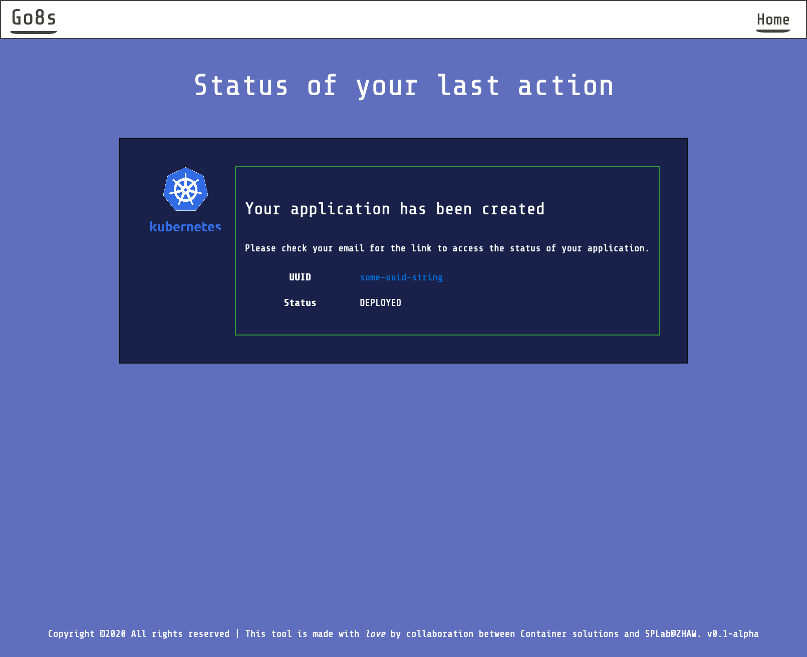

# parvaeres-ui
The UI of Parvaeres/GOK8S

## Build Docker image
To build the container image, run -
```bash
docker build -t parvaeres/go8s-ui:latest .
```

## Run the UI server
To start the parvaeres UI server, use -
```bash
docker run --rm --env APIHOST=<parvaeres-api-server> --env APIVERSION=v1 --env MAOHOST=<artifacts-observatory-server> -p 9000:9000 parvaeres/go8s-ui:latest
```

A test artifacts observatory server is running at: http://160.85.252.48:8080. Once the service is up and running, point your browser to ```localhost:9000``` and experience
the ease of Kubernetes application deployment. 

## Local development

The script

```
./scripts/run-locally.sh
```

will run the parvaeres UI server and mount the static assets (./public) and templates (./app/views) directory in the running docker image. This means that local changes should be visible in the UI running at ```localhost:9000``` (you might need to CTRL+F5 to view the changes because of browser cache).

### Run with a local parvaeres-server instance

Assuming your `parvaeres-server` checkout is in the `parvaeres-server` directory, you can
run both `parveres-server` and `parvaeres-ui` locally and make them talk to eachother
without having to rebuild your image and deploy to the cluster. Here's how:

```
cd parvaeres-server
./scripts/k3s-test-cluster.sh up
make k3s-build k3s-push k3s-deploy
export PARVAERES_SERVER_IP=$(kubectl get services -n argocd parvaeres-server -o jsonpath='{.status.loadBalancer.ingress[0].ip}'
```

At this point you can run `parvaeres-ui` locally while specifying the server address:

```
APIHOST=${PARVAERES_SERVER_IP}:8080 scripts/run-locally.sh
```

## Using the service


Simple provide the Kubernetes application's github link ending in .git, specify the 
appropriate folder which contains your application manifest files, provide your email, and
hit ```Validate & deploy application``` button. You can now inspect the application that you are about to deploy.

If artifact observatory service has been configured and if any specific validation page
exists for any of the files in the specified folder, an additional button will appear which will allow you to check the status
of the validation step.


You can click on ```Inspect File``` button to see the content of any specific file in your remote application specification folder.


Once you are happy with the details of the folder, you can hit ```Deploy application``` button.



In a few minutes, check your inbox. You will receive an email which contains the permanent link 
to your Kubernetes application. Use the contained link to see the latest status of your application.

If your application requests publicly accessible IP, please wait for a few seconds before ```Live URLs```
gets displayed within the UI.


## Licensing and distribution
Licensed under the Apache License, Version 2.0 (the "License");
you may not use this file except in compliance with the License.
You may obtain a copy of the License at

  http://www.apache.org/licenses/LICENSE-2.0

Unless required by applicable law or agreed to in writing, software
distributed under the License is distributed on an "AS IS" BASIS,
WITHOUT WARRANTIES OR CONDITIONS OF ANY KIND, either express or implied.
See the License for the specific language governing permissions and
limitations under the License.