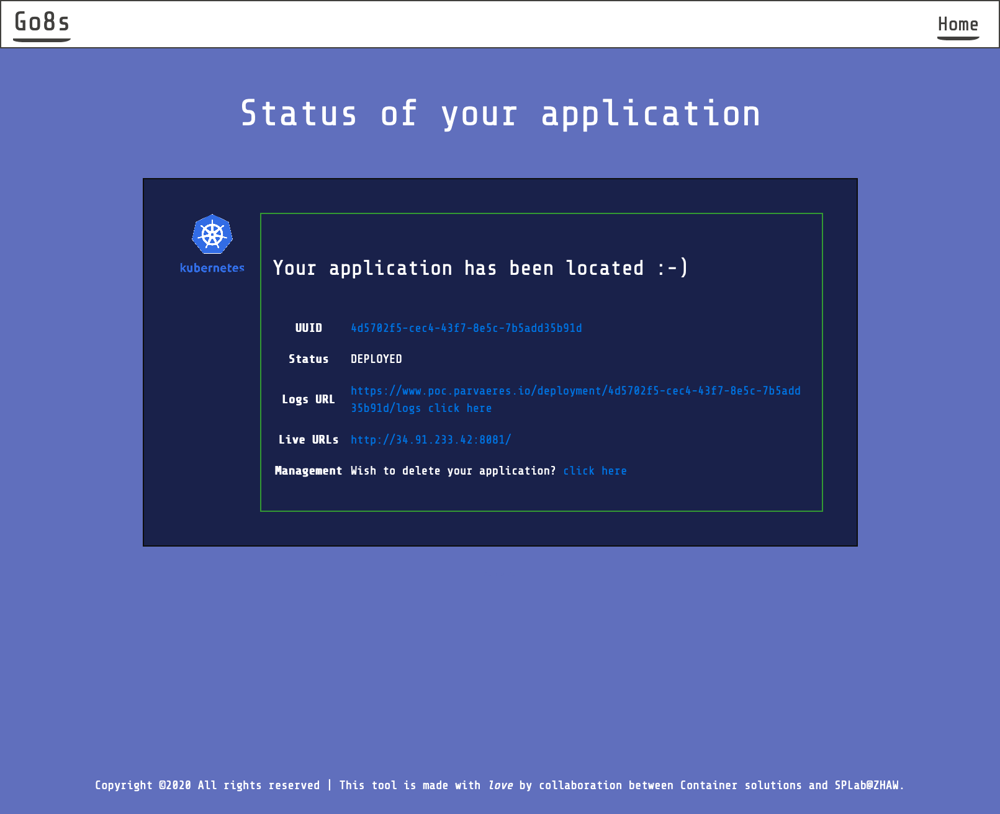

# parvaeres-ui
The UI of Parvaeres/GOK8S

## Build Docker image
To build the container image, run -
```bash
docker build -t parvaeres/go8s-ui:latest .
```

## Run the UI server
To start the parvaeres UI server, use -
```bash
docker run --rm --env APIHOST=<parvaeres-api-server> --env APIVERSION=v1 -p 9000:9000 parvaeres/go8s-ui:latest
```

Once the service is up and running, point your browser to ```localhost:9000``` and experience
the ease of Kubernetes application deployment. 

## Local development

The script

```
./scripts/run-locally.sh
```

will run the parvaeres UI server and mount the static assets (./public) and templates (./app/views) directory in the running docker image. This means that local changes should be visible in the UI running at ```localhost:9000``` (you might need to CTRL+F5 to view the changes because of browser cache).

## Using the service


Simple provide the Kubernetes application's github link ending in .git, specify the 
appropriate folder which contains your application manifest files, provide your email, and
hit ```Deploy application``` button.

In a few minutes, check your inbox. You will receive an email which contains the permanent link 
to your Kubernetes application. Use the contained link to see the latest status of your application.


